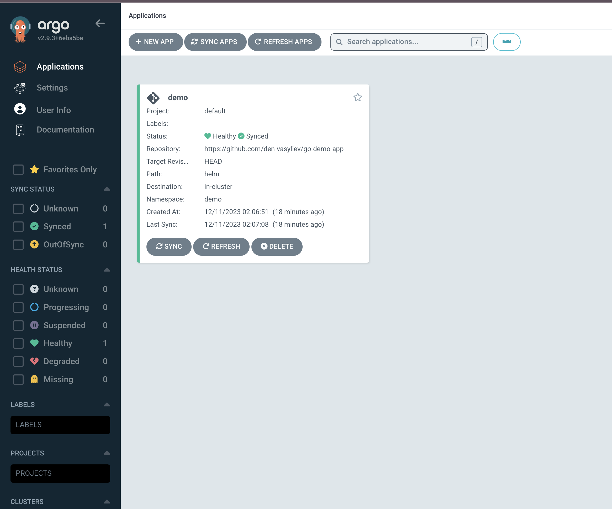
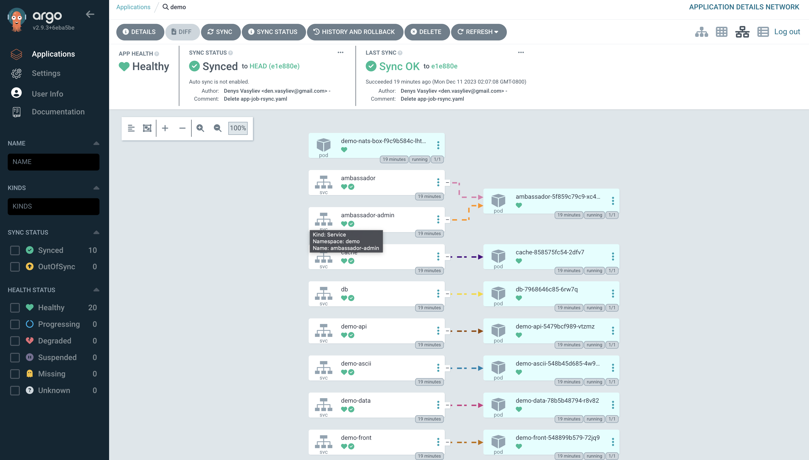
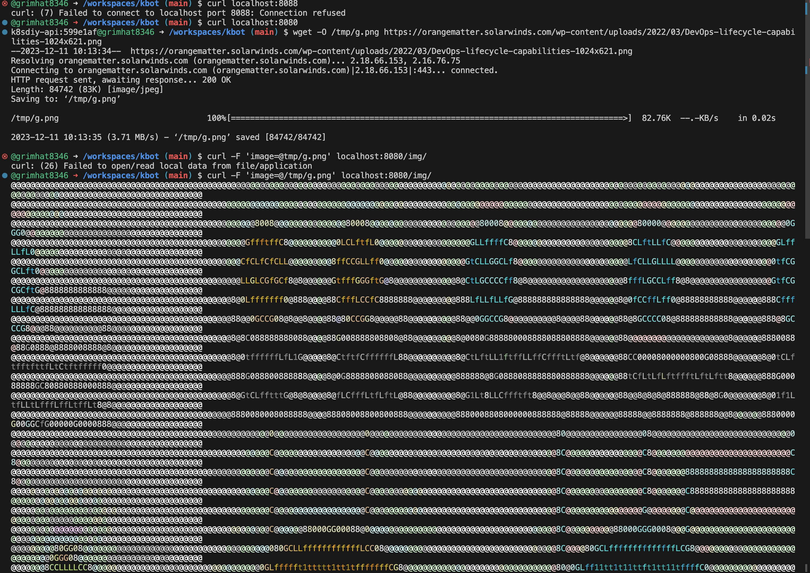

# AsciiArtify. Minimum Viable Product

> Налаштовуємо застосунок, який буде автоматично розгортатися в Kubernetes

1. В панелі AgroCD натискаємо `+ NEW APP`
2. У модальному вікні, що відкрилося, заповнюємо поля:

   - **Applicaton Name:** назва застосунку
   - **Project Name:** default
   - **AUTO-CREATE NAMESPACE:** ✓
   - **Repository URL:** посилання на репозиторій, що містить маніфести для розгортання
   - **Revision:** HEAD
   - **Path:** helm
   - **Cluster URL:** [https://kubernetes.default.svc](https://kubernetes.default.svc/)
   - **Namespace:** demo
3. Натискаємо `CREATE`

   В результаті на панелі відобразиться доданий застосунок:

   

4. AgroCD аплікейшн створено, але поки не розгорнуто. Розгорнемо ж його, здійснивши першу синхронізацію, натиснувши кнопку `Sync` та обравши в данному випадку всі компоненти зі списку. 

   

   Згодом статуси зміняться на **Healthy**, **Syned**, **Sync OK**, це означатиме, що проект повністю розгорнуто, а стан вихідного коду відповідає стану в репозиторії.

5. Перевіремо роботу застосунку.

     Результат:

     

 